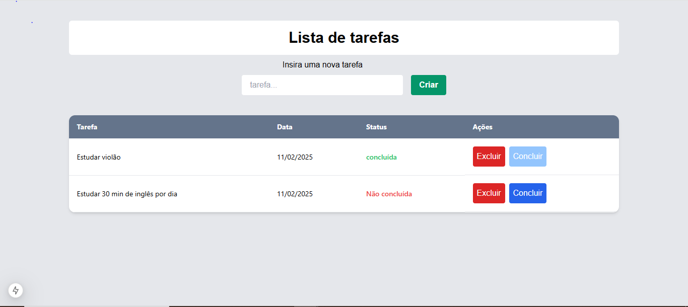

# TODO LIST
Este é um projeto de lista de tarefas fullstack, onde o usuário tem capacidade de ler, criar, deletar e marcar com concluída a tarefa.
Para pode rodar o projeto, será necessario instalar as indepências do frontend, backend e instalar o banco de dados.
## Banco de dados
O banco de dados utilizado foi mysqli para salvar as tarefas.
O banco contém o banco de dados chamado to_do_list que contêm apenas 1 tabela chamada tasks
### Tasks
| id  | title | completed | created_at |
| -------- | ----- | -------- | ----- |
| integer  | text  | boolean | timestamp | 

- id: identificador único da tarefa.
- title: nome da tarefa.
- completed: status da tarefa (true ou false).
- created_at: data de criação da tarefa.

## Api
A linguagem utilizada para a foi o node js no padrão REST.
As tecnologias utilizadas no backend foram: 
- Express js: É um framework web para Node.js que permite criar aplicações web facilmente, com uma API flexível e escalável.
- Typescript: É uma linguagem variante do JavaScript que adiciona tipagem estática opcional e outras características para ajudar a construir aplicações mais escaláveis.
- Mysql2: É uma biblioteca utilizada para fazer a conexão com o banco de dados mysqli.
- Cors: para liberar o acesso à API.
- dotenv: biblioteca utilizada para carregar as variáveis de ambientes
- express-async-errors: biblioteca utilizada para tratamento de error da api
## Frontend
No frontend a tecnologia utilizada foi o Nextjs.
As principais tecnologias utilizadas no frontend foram: 
- Axios: Biblioteca utilizada para fazer requisições.
- tailwind css: Biblioteca de estilização css
- react-hot-toast: Biblioteca utilizada para criar mensagens de notificação em tela.
- classnames: Uma simples utilidade JavaScript para juntar nomes de classes condicionalmente.

### Páginas
#### Task
Página onde a pessoa usuária pode ver todas as suas tarefas, além de marcar como concluidas, deletá-las e criar novas


## Executando o projeto
#### Pré-requisitos
- Ter o node js instalado.
- Clona este repositorio. 
- Criar um arquivo .env na raiz do projeto, com base no .env.example, definindo os valores de cada variável de ambiente usada.
### Passo a passo
##### primeiro você terá que configurar o banco de dados.
1 - você terá que iniciar o banco de dados na sua máquina
2 - você terá que usar o o seguinte comando para fazer a criação das tabelas
```sql
CREATE DATABASE to_do_list;
USE to_do_list;

CREATE TABLE tasks (
    id INT AUTO_INCREMENT PRIMARY KEY,
    title TEXT NOT NULL, 
    completed BOOLEAN DEFAULT false,
    created_at TIMESTAMP DEFAULT CURRENT_TIMESTAMP
);
```
##### agora você terá que configurar o backend.
Na raiz do projeto, execute o seguinte comando: 
```cmd
cd backend
npm i
```
logo, após, use o comando a seguir para rodar o servidor
```
npm run dev
```
#### agora você terá que configurar o frontend.
Abra outro terminal e na raiz do projeto digite os seguintes comando: 
```cmd
cd frontend
npm i
```
logo, após, use o comando a seguir para rodar o servidor frontend
```
npm run dev
```
Pronto, configuração finalizada
